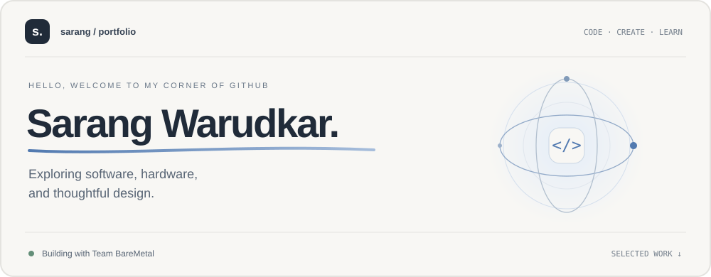

  

  <a href="#about">About</a>
  &nbsp;&nbsp; / &nbsp;&nbsp;
  <a href="#selected-work">Selected work</a>
  &nbsp;&nbsp; / &nbsp;&nbsp;
  <a href="#interests">Interests</a>
  &nbsp;&nbsp; / &nbsp;&nbsp;
  <a href="#team-baremetal">Team</a>

 

## About

I'm **Sarang Warudkar**, part of **Team BareMetal**.

I'm interested in how software, electronics, and thoughtful design
come together to solve practical problems. I enjoy exploring ideas
through projects, simulations, and interfaces that make complex
systems easier to understand.

Currently focused on **Trinetra**—our team's modular railway safety
screening concept.

> Understand the problem. Make the idea tangible. Keep improving.

 

## Selected work

### Trinetra–BareMetal

**One sensor core. Three form factors.**

Trinetra explores a modular approach to railway safety screening.
At its centre is a proposed **detachable sensor core** designed
for use across three complementary device formats.

| Format | Intended purpose |
| :--- | :--- |
| **Mobile robot** | Carry the sensor core between screening locations. |
| **Handheld device** | Support focused checks by an operator. |
| **Fixed node** | Support monitoring at a designated location. |

The concept brings together complementary sensing inputs,
evidence corroboration, and human review to support more
informed screening decisions.

**Screen → Corroborate → Decision support → Human review**

The project is communicated through an **interactive website**,
a **simulation**, **device visualisations**, and an **explainer video**.
Together, these illustrate the proposed architecture and user experience.

*Current stage: student concept and simulation. Demonstrations illustrate
intended behaviour; real-world detection performance requires validation.*

[**Explore the repository ↗**](https://github.com/vahnivesh/Trinetra-BareMetal)
&nbsp; · &nbsp;
[Read the project overview](https://github.com/vahnivesh/Trinetra-BareMetal#readme)

<!-- Add verified website, simulation, and video links here when ready. -->

 

## Interests

**Connected systems**  
Exploring how sensors, devices, and software work together.

**Interactive experiences**  
Making technical information clear, useful, and approachable.

**Simulation and visualisation**  
Making system behaviour easier to explore and explain.

**Practical engineering**  
Connecting ambitious ideas with testable next steps.

 

## How I approach a project

| | |
| :--- | :--- |
| **01 / Understand** | Start with the problem, the setting, and the people involved. |
| **02 / Build** | Turn the idea into something concrete enough to examine. |
| **03 / Refine** | Use feedback and evidence to guide the next improvement. |
| **04 / Explain** | Make the design, progress, and limitations easy to follow. |

 

## Team BareMetal

**Different perspectives. A shared engineering challenge.**

Trinetra is a collaborative project developed with:

| | |
| :--- | :--- |
| [Vahnivesh S Shine](https://github.com/vahnivesh) | [Sarang Warudkar](https://github.com/sarangkw1116-oss) |
| Om Spandan Patnaik | Macha Raghunandan |
| Shreya Nayak | Smitha Mallya |

[**Explore what we're building ↗**](https://github.com/vahnivesh/Trinetra-BareMetal)

 

---

  <b>Thanks for stopping by.</b>
   
  Explore the work. Follow the progress.
    
  <a href="https://github.com/sarangkw1116-oss?tab=repositories">Repositories</a>
  &nbsp; · &nbsp;
  <a href="https://github.com/vahnivesh/Trinetra-BareMetal">Trinetra</a>

 

  SARANG WARUDKAR &nbsp; / &nbsp; TEAM BAREMETAL

